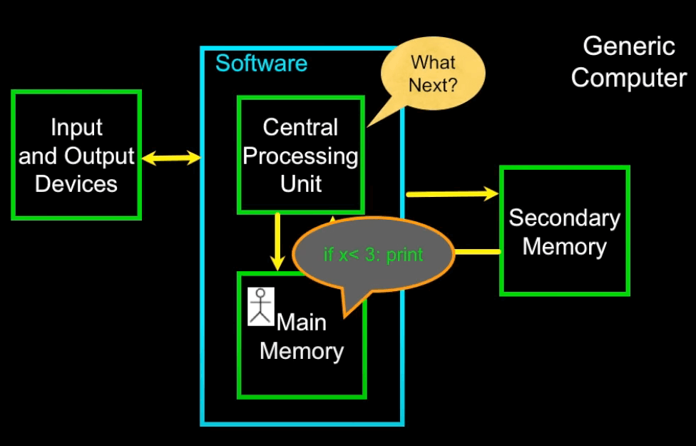
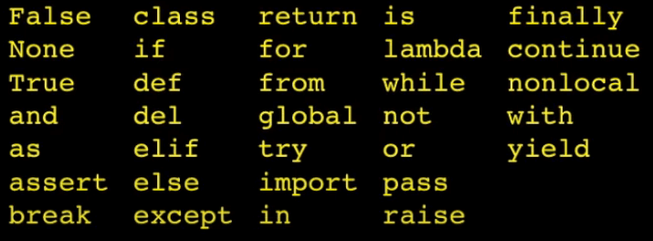
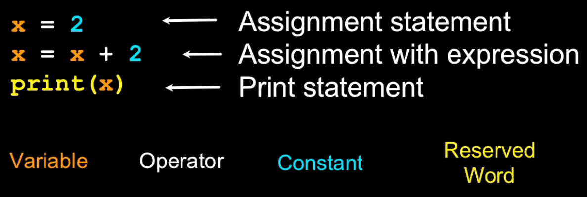

# Table of Contents

- [Table of Contents](#table-of-contents)
  - [1.1 Who should learn to program?](#11-who-should-learn-to-program)
    - [Challenge Solution](#challenge-solution)
  - [2.1. Where are your programs stored when they are running?](#21-where-are-your-programs-stored-when-they-are-running)
    - [Challenge Solution](#challenge-solution-1)
  - [Notes](#notes)
  - [3.1. What will print out after running these two lines of code?](#31-what-will-print-out-after-running-these-two-lines-of-code)
    - [Challenge Solution](#challenge-solution-2)
  - [4.1. What will the following program print out?](#41-what-will-the-following-program-print-out)
    - [Challenge Solution](#challenge-solution-3)
  - [Notes](#notes-1)
    - [Reserved Words](#reserved-words)
    - [Sentences or Lines](#sentences-or-lines)


<!-- Logo and Header -->
<div>
    
    <h1 style="border-bottom: none">
        1. Why Program? 
    </h1>
</div>

## 1.1 Who should learn to program?

### Challenge Solution

Everyone.

<!-- Logo and Header -->
<div>
    
    <h1 style="border-bottom: none">
        2. Hardware Architecture 
    </h1>
</div>

## 2.1. Where are your programs stored when they are running?

### Challenge Solution

Memory.


## Notes
* **Central Processing Unit:** Runs the program - The CPU is always wondering "what to do next". Not the brains exactly - very dumb but very fast
* **Input Devices:** Keyboard, Mouse, Touch Screen
* **Output Devices:** Screen, Speakers, Printer, DVD Burner
* **Main Memory:** Fast small temporary storage - lost on reboot - aka RAM
* **Secondary Memory:** Slower large permanent storage - lasts until deleted - disk drive / memory stick

<p align="center">
    
</p>

Your Python code is stored in your secondary memory, then that is loaded into main memory and while you are running, it's communicating with your CPU a billion times a second.

Python just translates your code into machine language.

<!-- Logo and Header -->
<div>
    
    <h1 style="border-bottom: none">
        3. Python as a Language 
    </h1>
</div>

## 3.1. What will print out after running these two lines of code?

```python
x = 6
print(x)
```

### Challenge Solution

6

<!-- Logo and Header -->
<div>
    
    <h1 style="border-bottom: none">
        4. Elements of Python 
    </h1>
</div>

## 4.1. What will the following program print out?

```python
x = 43
x = x + 1
print(x)
```

### Challenge Solution

44


## Notes

### Reserved Words

You cannot use reserved words as variable names / identifiers.

<p align="center">
    
</p>

### Sentences or Lines

<p align="center">
    
</p>