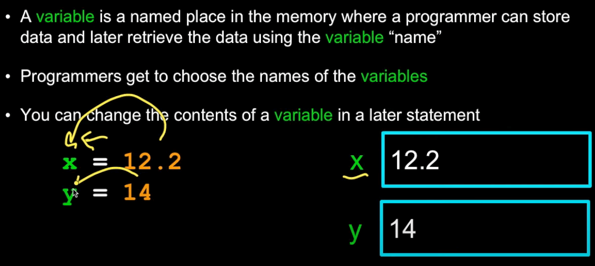

<!-- Logo and Header -->
<div>
    
    <h1 style="border-bottom: none">
        1. Variables, Expressions, and Statements 
    </h1>
</div>

1.1. What is the symbol used in an assignment statement?
----------

### Challenge Solution

=


Notes
----------

### Constants

<p align="center">
    
</p>

### Variables

Find some memory, give it a label like `x` and stick `12.2` in it. The same for 14. So it's reading from right to left.

<p align="center">
    
</p>

<!-- Logo and Header -->
<div>
    
    <h1 style="border-bottom: none">
        2. Intermediate Expressions 
    </h1>
</div>

2.1. What will print out after running this code?
----------

```python
width = 15
height = 12.0
print(height/3)
```

### Challenge Solution

=