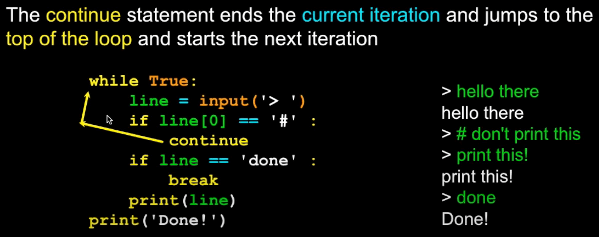
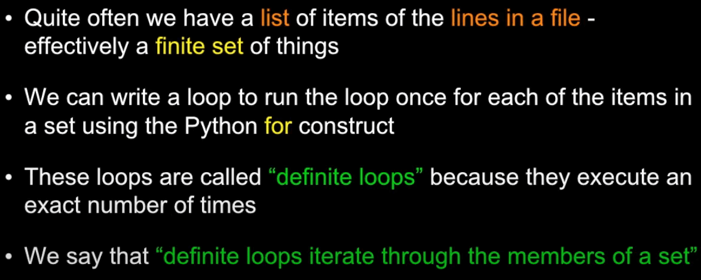
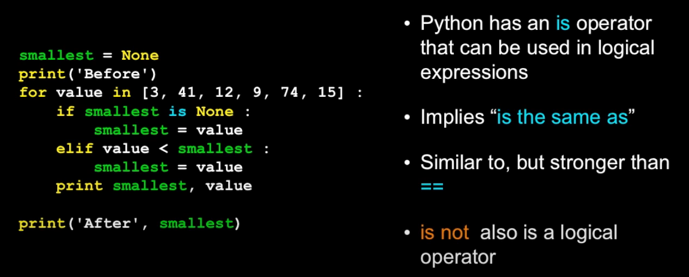

<!-- Logo and Header -->
<div>
    
    <h1 style="border-bottom: none">
        1. Loops and Iterations 
    </h1>
</div>

1.1. What will the following code print out?
----------

```python
n = 0
while True:
    if n == 3:
        break
    print(n)
    n = n + 1
```

### Challenge Solution

0\
1\
2


Notes
----------

### Using continue keyword

<p align="center">
    
</p>

<!-- Logo and Header -->
<div>
    
    <h1 style="border-bottom: none">
        2. Iterations: Definite Loops 
    </h1>
</div>

2.1. How many lines will the following code print?:
----------

```python
for i in [2,1,5]:
    print(i)
```

### Challenge Solution

3


Notes
----------

### Definite Loops

<p align="center">
    
</p>

<!-- Logo and Header -->
<div>
    
    <h1 style="border-bottom: none">
        3. Iterations: Loop Idioms 
    </h1>
</div>

3.1. Below is code to find the smallest value from a list of values. One line has an error that will cause the code to not work as expected. Which line is it?
----------

```python
smallest = None
print("Before:", smallest)
for itervar in [3, 41, 12, 9, 74, 15]:
    if smallest is None or itervar < smallest:
        smallest = itervar
        break
    print("Loop:", itervar, smallest)
print("Smallest:", smallest)
```

### Challenge Solution

6

<!-- Logo and Header -->
<div>
    
    <h1 style="border-bottom: none">
        4. Iterations: More Patterns 
    </h1>
</div>

4.1. Which of these evaluates to False?
----------

### Challenge Solution

0 is 0.0


Notes
----------

### The "is" and "is not" Operators

<p align="center">
    
</p>

- Both **==** and **is** or **is not** return a boolean (True or False).
- These operators imply the same, however, **is** demands both the equality of the type and value of the variable, unlike **==** which only implies the value

**Example**

- **0 == 0.0? True** because it's the same value-wise.
- **0 is 0.0? False** although the same value, it's not the same type (int vs float)

**When to use**

- Do not overuse "is" or "is not  
- If you are dealing with numbers or even strings use "==".\
Use "is" on booleans and None types.