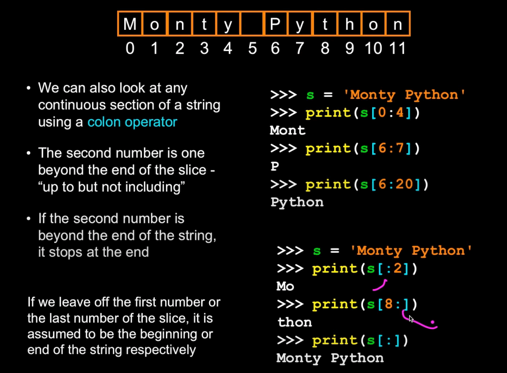
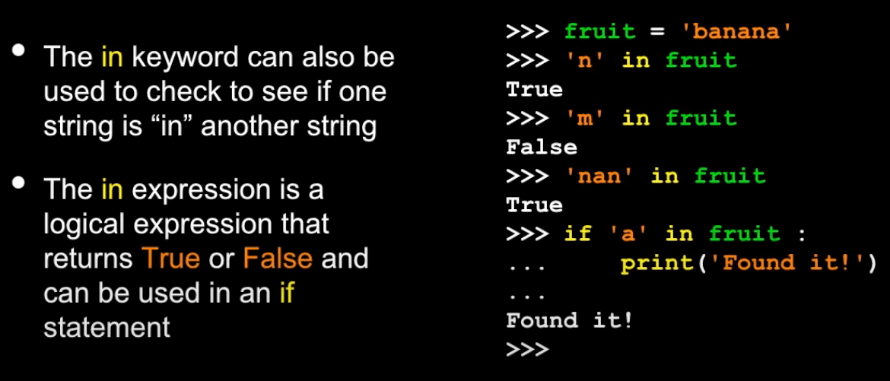

<!-- Logo and Header -->
<div>
    
    <h1 style="border-bottom: none">
        1. Strings in Python 
    </h1>
</div>

1.1. What will the following code print?
----------

```python
for n in "banana":
    print(n)
```

### Challenge Solution

b\
a\
n\
a\
n\
a

<!-- Logo and Header -->
<div>
    
    <h1 style="border-bottom: none">
        2. Intermediate Strings 
    </h1>
</div>

2.1. What is the value of i in the following code?
----------

```python
word = "bananana"
i = word.find("na")
```

### Challenge Solution


Notes
----------

### String Slicing

<p align="center">
    
</p>

### Using in as a logical Operator

<p align="center">
    
</p>