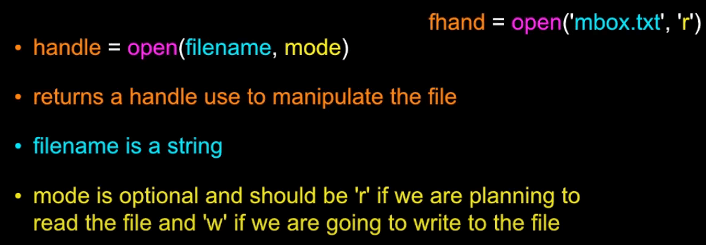

<!-- Logo and Header -->

    
    <h1 style="border-bottom: none">
        1. Reading Files 
    </h1>

1.1. What is used to indicate a new line in a string?
----------

### Challenge Solution

\n

Notes
----------

### Using open()

    

### What is a Handle?

A handle doesn't print the lines in the file.\
It's like a middle-man that helps you get to the file.

    

<!-- Logo and Header -->

    
    <h1 style="border-bottom: none">
        2. Files as a Sequence 
    </h1>

2.1. What does the word 'continue' do in the middle of a loop?
----------

### Challenge Solution

Skips to the next iteration of the loop.
